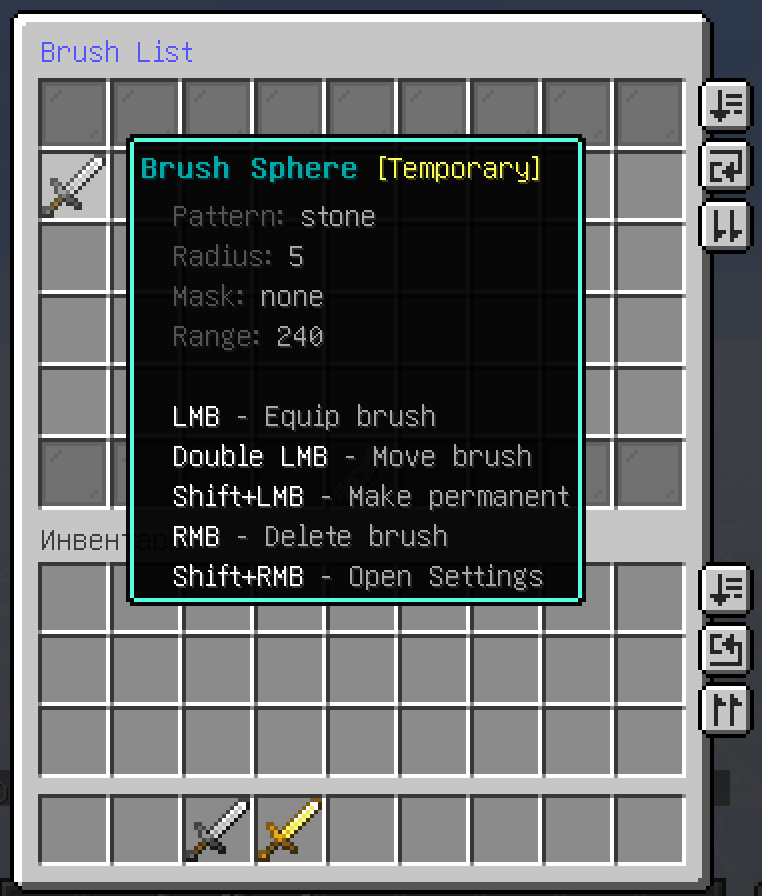
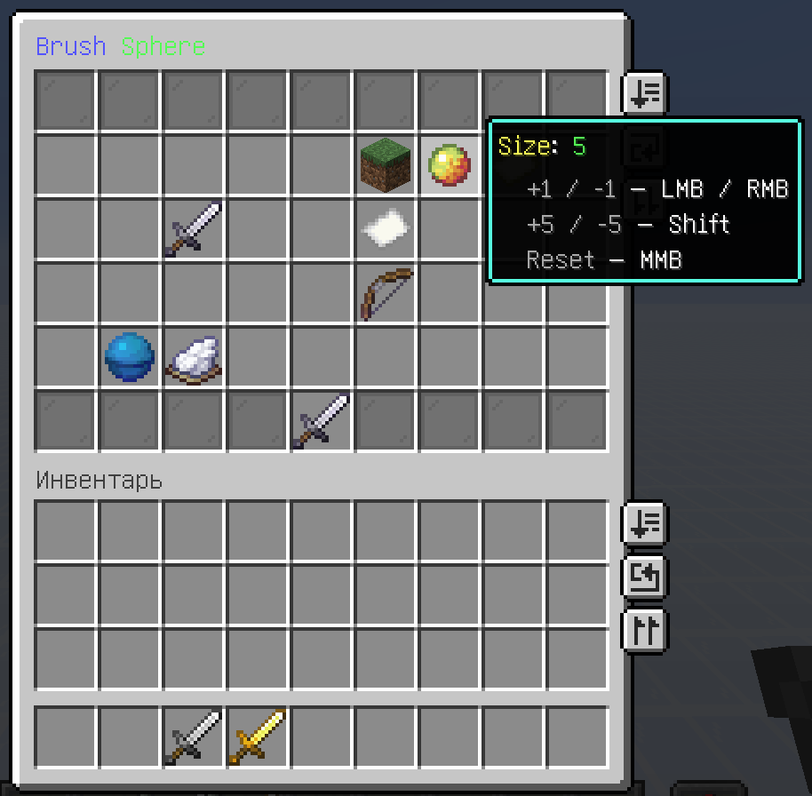
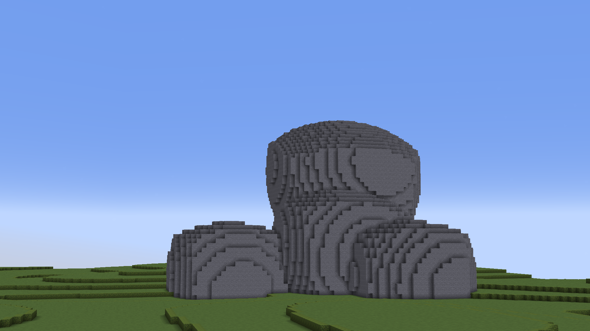
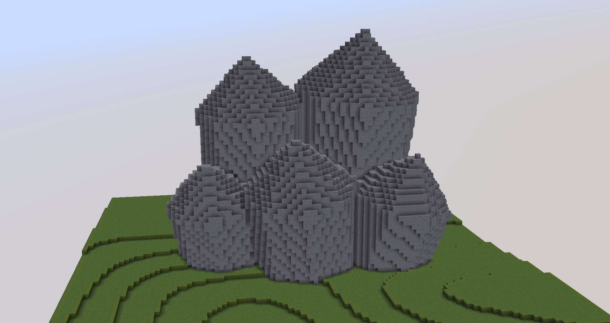

<div class="feature-lite" markdown>

Brush GUI

All brushes — FAWE, Arceon (if installed), and 1b1v — are combined in a single GUI menu. It lets you manage your brushes: switch between them, fine-tune them, and save them as persistent so they survive a server restart.

The brush list shows key info for each brush — pattern, mask, size, and range. From here you can select a brush or remove it from the list.

Brush List GUI
```text
/1b1v brushes
```

`Basic Permission: 1b1v.use`

Opening a brush from the list reveals its settings menu, where you can edit its pattern, mask, and size directly — no commands required. The same menu can also be opened instantly for the brush currently in your hand.

Brush Settings GUI
```text
/1b1v brush
```

`Basic Permission: 1b1v.use`

</div>

<div class="feature-lite" markdown>

Brush Plump
A brush that creates a convex rock formation. Perfect for building organic shapes and smooth stone structures.

```text
/br plump [block] [size]
```


`Intermediate Permission: 1b1v.brush.plump`

</div>

<div class="feature-lite" markdown>

Brush Crystal
A brush that creates sharp, geometric crystal clusters. Perfect for building crystalline formations and faceted mineral structures.

```text
/br crystal [block] [size]
```


`Intermediate Permission: 1b1v.brush.crystal`

</div>