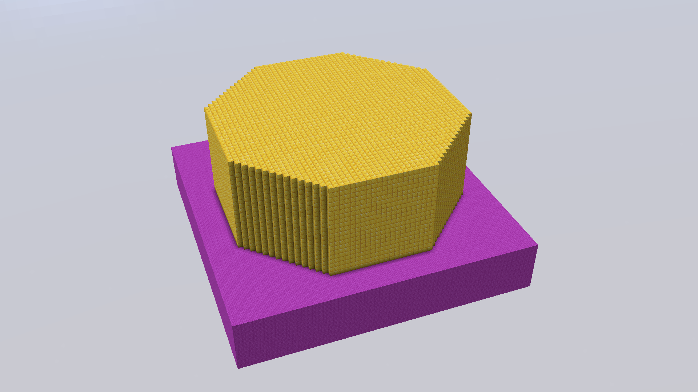
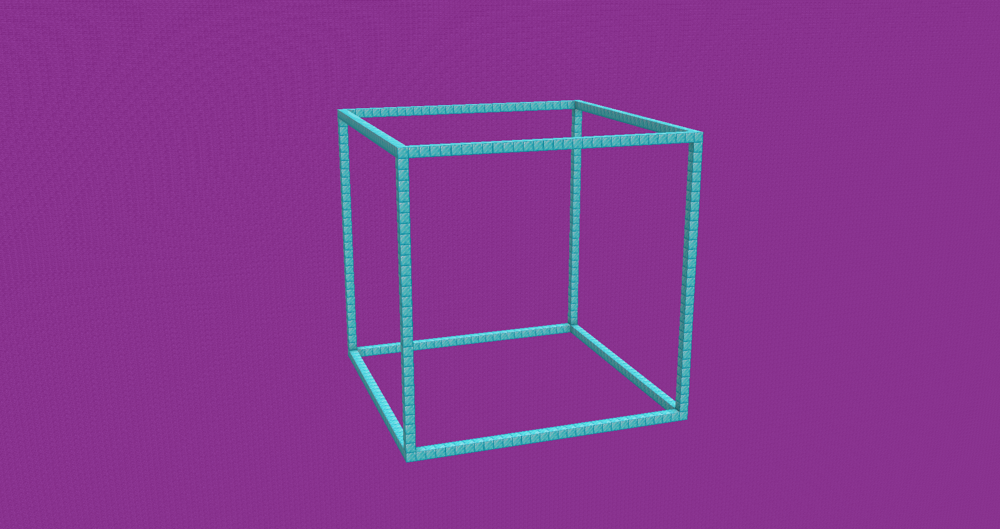
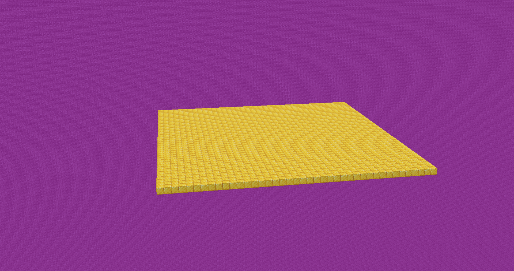
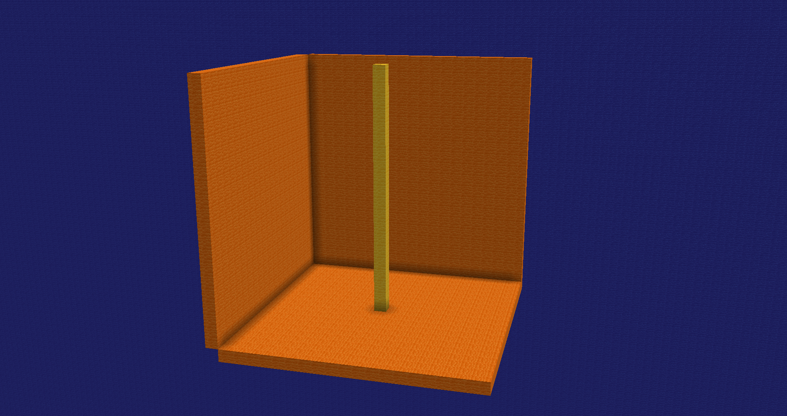
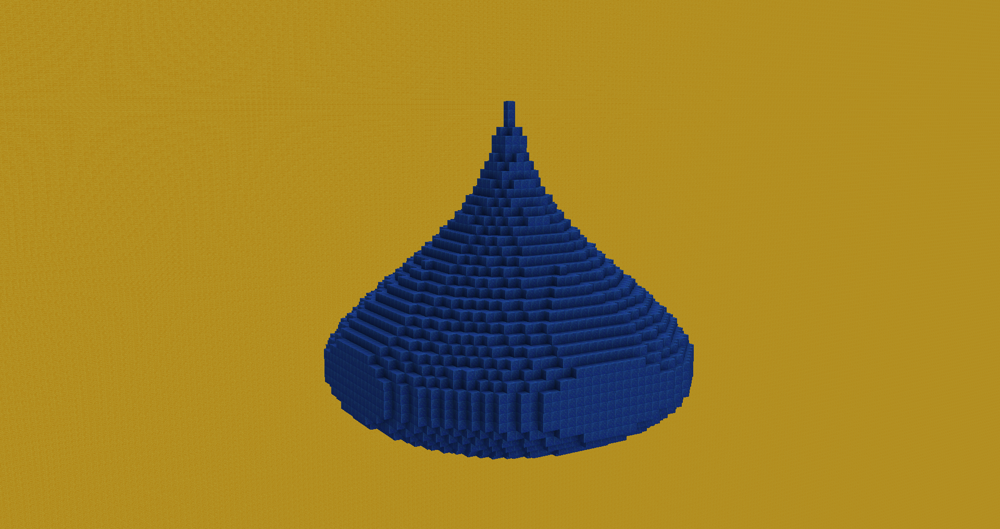
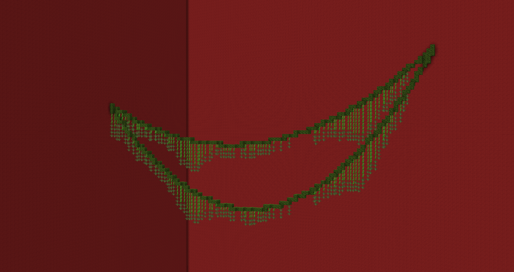

---
Polygon
Creates a polygon with a specified number of sides. The default value is 8.

```text
//polygon [block] [number of corners]
```


`Permission: orion.selection.polygon`

---
<br>

Frame
....

```text
//frame [block]
```


`Permission: orion.selection.frame`

---
<br>

Platform
Creates a flat platform or surface at the bottom of your selection.

```text
//plat [block] [size]
```


`Permission: orion.selection.platform`

---
<br>

Center Vertical
Similar to the //center command, but creates a vertical one-block column running from the bottom to the top of the selection.

```text
//cver [block]
```


`Permission: orion.selection.centervertical`

---
<br>

Onion
Generates an onion-shaped dome or structure within the selected area.

```text
//onion [block]
```


`Permission: orion.selection.onion`

---
<br>

Liana
Creates a hanging vine or liana, with the bend intensity controlled by the sagging parameter.

```text
//liana [sagging]
```


`Permission: orion.selection.liana`