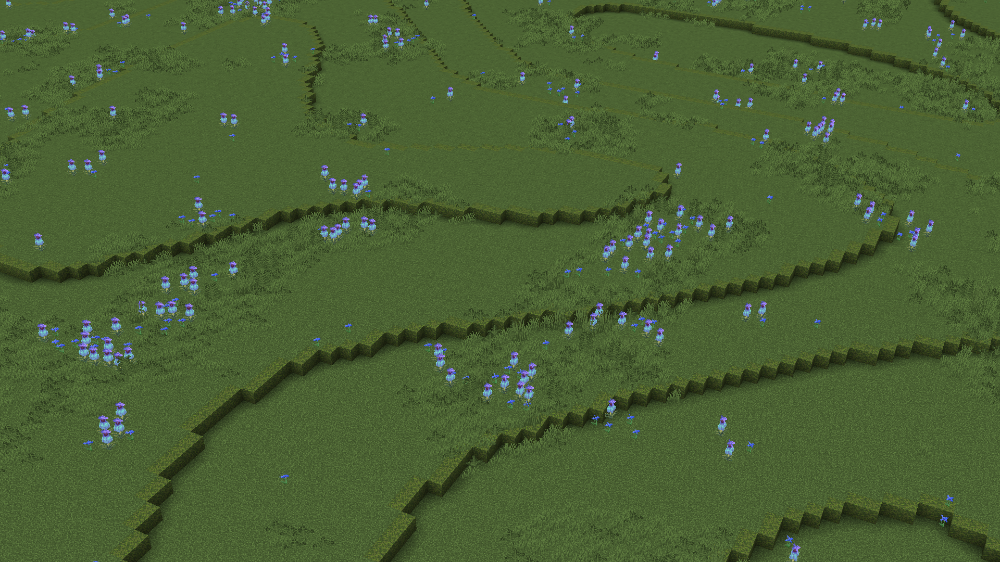
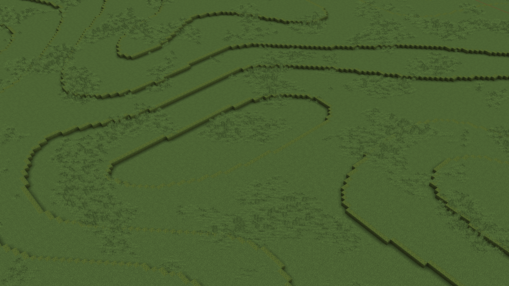

---
Flowers
Generates realistic patches of flowers instead of chaotic, random scattering.

```text
#flowers[frequency]
```

`Permissions: orion.pattern.flowers`

---
<br>

Grass
Replaces the surface with `grass_block` and adds a `moss_block` border. The angle parameter limits the slope of the applied pattern.

```text
#grass[id][angle]
```

`orion.pattern.grass`

---
<br>

Ridgedmulti
Ridged Multifractal (ridgedmulti) is a procedural noise pattern that generates sharp, narrow ridges separated by smooth, concave valleys

```text
#ridgedmulti[size][id]
```

`orion.pattern.ridgedmulti`
