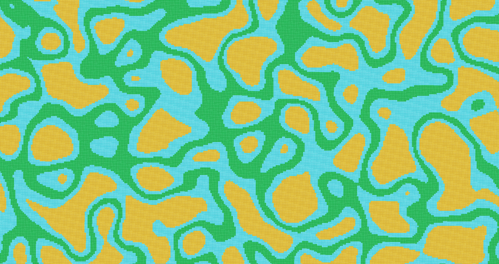

<div class="feature-lite" markdown>

Flowers
Generates realistic patches of flowers instead of chaotic, random scattering.

```text
#flowers[frequency]
```

`Basic Permissions: 1b1v.pattern.flowers`

</div>

<div class="feature-lite" markdown>

Grass
Replaces the surface with `grass_block` and adds a `moss_block` border. The angle parameter limits the slope of the applied pattern.

```text
#grass[id][angle]
```

`Intermediate Permissions: 1b1v.pattern.grass`

</div>

<div class="feature-lite" markdown>

Ridgedmulti
Ridged Multifractal (ridgedmulti) is a procedural noise pattern that generates sharp, narrow ridges separated by smooth, concave valleys

```text
#ridgedmulti[size][id]
```

`Basic Permissions: 1b1v.pattern.ridgedmulti`

</div>